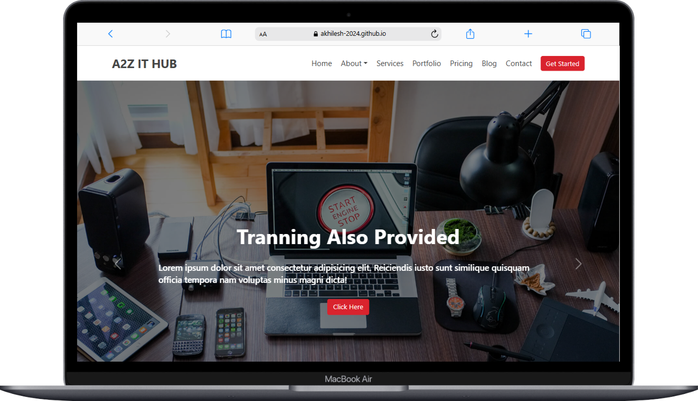

# 🚀 A2Z IT HUB – Responsive Multi-Page Portfolio Website

<p align="center">
  
</p>

<div align="center">
  
  
  
  
</div>

---

## ✨ Key Features

- **Responsive Design**
  - Mobile-first, cross-device compatibility
  - Adaptive layouts for all screen sizes

- **Multi-Page Structure**
  - 🏠 Home – Company introduction and highlights
  - ℹ️ About Us – Company overview and team
  - 💼 Services – IT services and solutions
  - 🖼 Portfolio – Projects and case studies
  - 👥 Team – Meet the professionals
  - 📞 Contact – Get in touch

- **Interactive Elements**
  - Smooth scroll navigation
  - Animated sections (AOS)
  - Portfolio filtering (Isotope)
  - Contact form with validation
  - Clean navigation bar

---


## 🖥️ Demo

- **Live Preview:**<br>
  <a href="https://akhilesh-2024.github.io/A2Z-IT-HUB" target="_blank"></a>

- **Local Preview:**<br>
  Open `index.html` in your browser or deploy to any static hosting service.

---

## 🛠️ Technologies Used

| Technology      | Purpose                        |
|-----------------|--------------------------------|
| HTML5           | Semantic page structure        |
| CSS3            | Styling and animations         |
| JavaScript      | Interactive functionality      |
| Bootstrap 5     | Responsive framework           |
| Font Awesome    | Icons and visual elements      |
| Google Fonts    | Typography                     |
| AOS, Isotope    | Animations & filtering         |

---

## 📂 Project Structure

```
A2Z-IT-HUB/
├── index.html
├── About.html
├── Services.html
├── Portfolio.html
├── Contact.html
├── Blog.html
├── Blog-detail.html
├── Pricing.html
├── css/
│   ├── Index.css
│   ├── Index.js
│   ├── isotopes.pkgd.min.js
│   └── aos-master/
│       └── ...
├── Sources/
│   └── [All images and assets]
└── README.md
```

---

## 🚀 Getting Started

1. **Clone or download the repository.**
2. **Open `index.html` in your browser.**
3. **Navigate using the menu to explore all pages.**

---

## 🌟 Special Features

- **Performance Optimized**
  - Compressed images
  - Minified CSS/JS
  - Lazy loading for images (where possible)

- **Accessibility**
  - Semantic HTML
  - Keyboard navigation
  - Color contrast compliance

- **SEO Ready**
  - Meta tags
  - Structured data

---

## 📝 License

This project is licensed under the MIT License.

---

<div align="center">
  <sub>Developed with ❤️ for A2Z IT HUB</sub>
</div>
